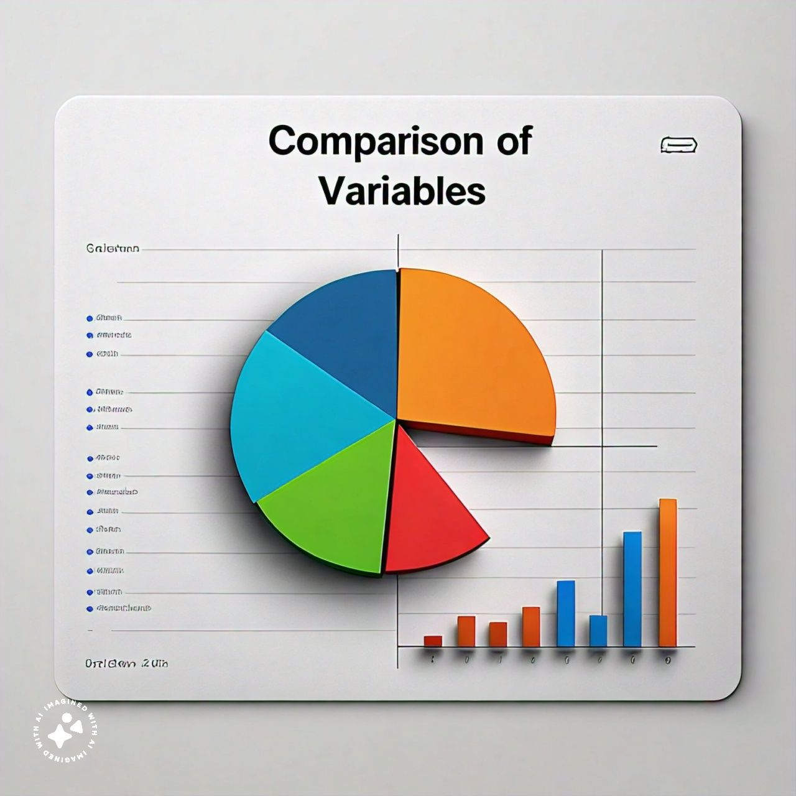

# FCB-Project-Alpha
---
## Analyzing Patient Outcomes in Hospitals: A Data-Driven Approach
---
### Project Description
#### This project uses data analysis and visualisation techniques to investigate the factors influencing hospital patient outcomes. The dataset contains information on patient demographics, medical conditions, treatment options, and outcome measures (e.g., length of stay, readmission rates, and patient satisfaction).
---
~~~
Google Query Sheet

SELECT * FROM TABLE 1
WHERE CONDITION = MET
~~~
---

_Above is the Data Visualization image_
### Objective
1. Explore the relationship between patient characteristics and outcomes
2. Identify high-risk patient groups and potential areas for quality improvement
3. Develop predictive models to forecast patient outcomes
4. Create interactive dashboards to visualize findings and facilitate hospital-wide decision-making
---
### Table
| Patient Name | Symptoms | Causes|
| ----------|-----------|----------|
| Slide 1| Slide 2| Slide 3| 
| Slide 4| Slide 5| Slide 6| 
| Slide 4| Slide 5| Slide 6| 
| Slide 4| Slide 5| Slide 6| 
| Slide 4| Slide 5| Slide 6| 

### Tools and Technologies
- [Python](https://www.python.org/downloads/) (Pandas, NumPy, Scikit-learn) 
- [Power BI](https://powerbi.microsoft.com/en-us/downloads/) (Data Modeling, Visualization, Dashboarding)
- [Excel](https://www.microsoft.com/en-us/microsoft-365/excel) (Data Cleaning, Preprocessing)
---
### Deliverables
1. Data wrangling and preprocessing script (Python)
2. Exploratory data analysis report (PDF)
3. Predictive modeling script (Python)
4. Interactive Power BI dashboard (PBIX file)
---
### Conclusion
This project demonstrates the power of data analysis in improving patient outcomes and hospital efficiency. Healthcare professionals can optimize treatment strategies, reduce costs, and enhance patient care by applying data-driven insights.

